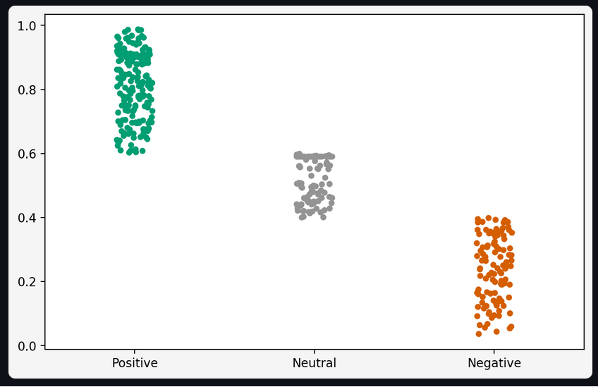
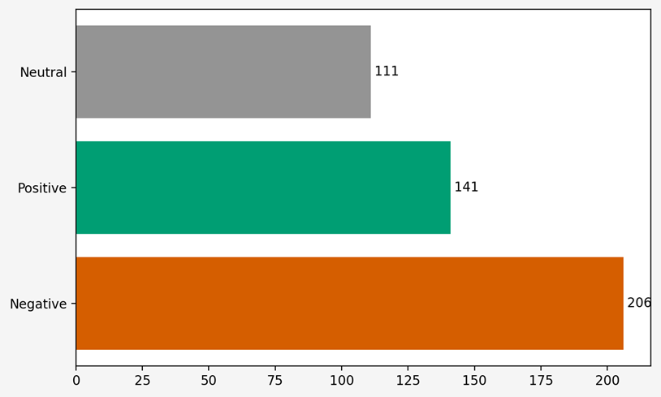
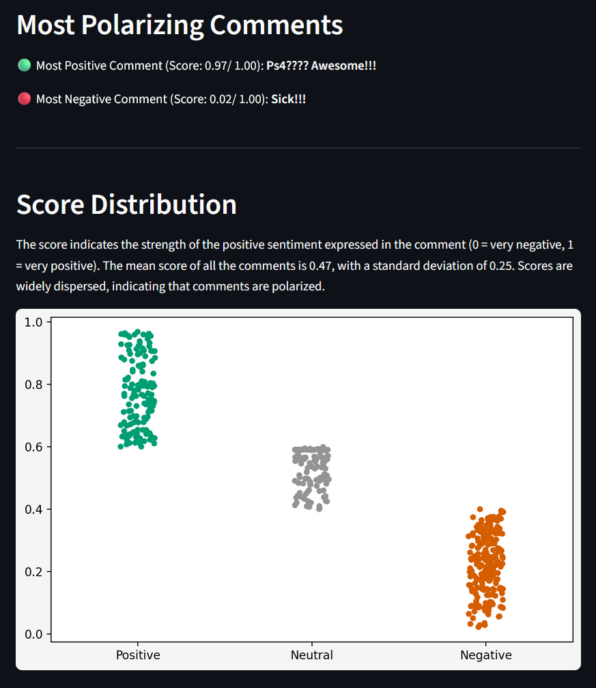
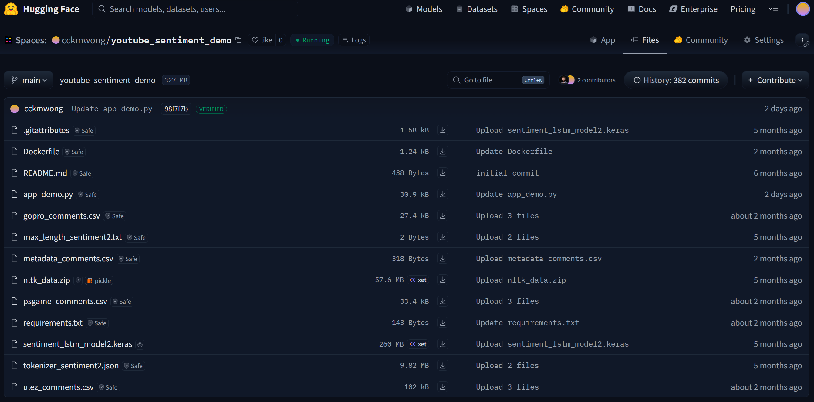
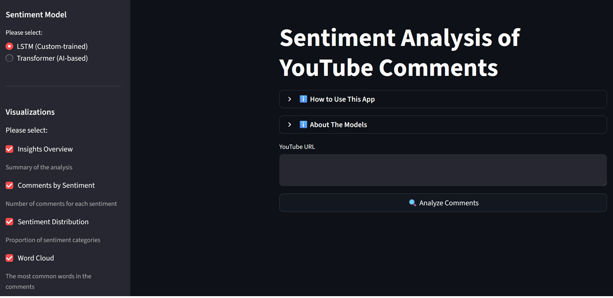

# Deep Learning-Based Sentiment Analysis

A deep learning sentiment analysis solution for interpreting real user feedback and extracting actionable insights from social media data.

---
## Highlights

- End-to-end sentiment analysis combining custom LSTM and transformer-based (RoBERTa) models
- Interactive Streamlit web application deployed on Hugging Face Spaces (zero cost free-tier deployment)
- Supports sentiment classification for real social media content (YouTube comments)
- Demonstrates practical business applications for marketing, product, and strategy teams
- Custom-trained deep learning model (LSTM) outperforms rule-based baselines (TextBlob and VADER)

---

## Skills Demonstrated

✔ **Deep Learning & Natural Language Processing (NLP)**: tokenization, embeddings, transformer inference

✔ **API & Data Handling**: YouTube sentiment datasets, API quota workarounds, preloading strategy for demo app

✔ **Model Development**: custom LSTM training, performance evaluation, model export

✔ **Comparative Benchmarking**: baseline comparison vs TextBlob and VADER

✔ **Application Deployment**: Streamlit UI, Hugging Face Spaces hosting with awareness of resource constraints

✔ **Business Analytics & Insight Generation**: sentiment interpretation, user behavior analysis, product & marketing implications

---

## Problem Statement
In the age of social media, understanding public sentiment has become essential for businesses, organizations, and researchers. Twitter, as one of the largest platforms for public expression, offers a vast and valuable source of data for sentiment analysis. 

The goal of this project is to develop a machine learning model capable of accurately classifying the sentiment of social media comments as either positive or negative. This analysis can provide actionable insights to help organizations tailor their products and marketing strategies, improve customer service, and ultimately enhance user satisfaction.

---

## Project Overview

> **Note:**  
> *This Streamlit application is hosted on the free tier of Hugging Face Spaces. If the app has been idle for more than 24 hours, it may take some time to reactivate. In such cases, please click “Restart this Space” to relaunch the application. Thank you for your patience.*

This project presents an end-to-end sentiment analysis system for YouTube comments, combining a custom deep learning model (LSTM) and a transformer-based model (RoBERTa), and deploying them through an interactive [Streamlit web application](https://huggingface.co/spaces/cckmwong/youtube_sentiment_demo). 

Due to daily quota limitations of the YouTube Data API, this demonstration uses preloaded comments to ensure a stable and consistent user experience while effectively showcasing the system’s sentiment analysis capabilities. **In a full implementation** (please click [here](https://youtu.be/KlG7qcbPQD4) for video demo), **users would be able to input any YouTube video URL and extract comments in real time using the YouTube Data API.** 

---

## Sentiment & Business Insights

In the demo application, different YouTube videos are used for sentiment analysis which include new product teaser and game trailer.

### [New Product Teaser - Everything New with GoPro HERO13 Black](https://youtu.be/_PMRqrna4sU?si=iTA2UgcpyBs6PrtG)
#### Business Impacts
- Measure customer excitement before product launch
- Identify potential concerns or negative reactions
- Improve marketing strategies and product positioning

#### Analysis
The overall sentiment analysis indicates a slightly positive but polarized user perception, with an average sentiment score of 0.58 / 1.00 across 402 comments. Positive feedback represents the largest share (44.8%), followed by neutral (28.9%) and negative (26.4%) comments. While positive sentiment dominates, the wide score dispersion highlights a clear divide between enthusiastic supporters and dissatisfied users.

From a business perspective, user sentiment is **strongly feature-driven rather than brand-driven**. Word cloud analysis shows that discussions are centered on product capabilities such as lens quality, sensor performance, battery life, software updates, and upgrades. Positive sentiment aligns closely with purchase intent and upgrade interest, indicating strong demand among early adopters and existing users.

Additionally, **frequent mentions of competitors including DJI and Osmo highlight a highly competitive market with low switching costs**, increasing the importance of clear differentiation and transparent communication.

#### Actionable Insights
Since there are concerns over specific product capabilities, the company can anchor marketing messages around quantifiable improvements: battery life increase (% or minutes), sensor performance (low-light, resolution, FPS), software or stabilization upgrades. 

In view of the fierce competition with low switching cost, the company can differentiate itself by explicitly positioning HERO13 against competitor by identifying the strengths competitors can’t match, for instance durability and accessories.

### [Game Trailer - Fallout 4: Anniversary Edition](https://youtu.be/dRpy9SYCxuk?si=nUJua0uA2XQZlHR5)
#### Business Impacts
- Understand player expectations and engagement
- Anticipate audience reception
- Support promotional decision-making

#### Analysis
The overall sentiment for this dataset skews negative and polarized, with an average sentiment score of 0.47 / 1.00 across 458 comments. Negative sentiment dominates the discussion (45.0%), outweighing positive (30.8%) and neutral (24.2%) feedback. The wide dispersion of sentiment scores confirms a strong divide between dissatisfied users and a smaller but vocal positive group.

From a business perspective, conversation is **heavily franchise- and release-driven rather than centered on gameplay mechanics alone**. Word cloud analysis shows dominant themes such as “Fallout,” “Bethesda,” “new,” “version,” “remaster,” “release,” and “DLC,” indicating that user sentiment is shaped largely by expectations around new releases, remakes, and updates.

Negative sentiment, however, is more prevalent and more specific. Common terms such as “old,” “nothing,” “mod,” (i.e. "modification"), “wait,” “money,” “need,” and “already” point to frustration with perceived lack of innovation, repetitive re-releases, and reliance on modding communities. Complaints appear less about technical failure and more about strategic direction and content freshness.

**The recurring appearance of “remaster” and “new version” in negative contexts suggests release fatigue.** Users expect substantive changes, not incremental updates to existing titles. When expectations are unmet, disappointment translates quickly into negative sentiment.

#### Actionable Insights
Sentiment is strongly influenced by release strategy, with disappointment in release fatigue. The company can lead messaging with what is genuinely new including systems, content depth and mechanics. 

### [Social Topic - What is London's controversial Ulez expansion?](https://youtu.be/2RqAwpjJatw?si=iw_8Esjgzw-LReQ2)
#### Aims
- Monitor public sentiment
- Assess reputational impact
- Inform communication and policy strategies

---

## Results Summary

- Custom LSTM achieved test accuracy of 0.78, outperforming TextBlob (0.61) and VADER (0.63)
- Transformer model (RoBERTa) demonstrated superior contextual understanding (especially negations and subtle emotional cues)
- Product teaser video: positive but polarized sentiment using LSTM model (avg score: 0.58 / 1.00) 
- Game trailer: negative skew due to release fatigue and unmet expectations using LSTM model (avg score: 0.47 / 1.00)
- Application successfully deployed to Hugging Face Spaces under zero-cost free tier
- Demonstrates practical uses for customer sentiment tracking, competitive strategy, and release planning

---

## Stages of Development

The whole project consists of two main stages:

1. **Model Development**
   - Data preprocessing and exploratory analysis
   - Training a custom LSTM sentiment analysis model
   - Compare the performance of the custom LSTM model with traditional approaches, TextBlob and VADER
   - Saving and exporting the trained model for deployment

3. **Model Deployment**
   - Hosting the trained LSTM model on Hugging Face
   - Integrating a transformer-based model (RoBERTa)
   - Deploying a Streamlit application that allows users to select and compare models

---

## Models

### Custom LSTM Model
- Trained on labeled sentiment data ([Sentiment140](https://cs.stanford.edu/people/alecmgo/trainingandtestdata.zip))
- Captures sequential and contextual patterns in text
- Saved and uploaded to Hugging Face for inference
- **Lightweight and fast to run**

### Transformer Model (RoBERTa)
- Pre-trained transformer-based sentiment analysis model
- Provides robust contextual understanding and strong performance
- **High accuracy on negations and subtle emotional cues**
- **Longer processing time due to larger model and heavier memory usage**

---

## Streamlit Application

The final deliverable of this project is a [Streamlit web application](https://huggingface.co/spaces/cckmwong/youtube_sentiment_demo) deployed on Hugging Face Spaces. We do not consider Streamlit Community Cloud due to the large file size of the model and complexity of the project.

### Features of the Demo Application
- Model selection:
  - Custom LSTM
  - Transformer (RoBERTa)
- Sentiment analysis on preloaded YouTube comments
- Interactive results display

### Full Application

In a full implementation of this application, users would be able to input any YouTube video URL, allowing the system to extract comments in real time using the YouTube Data API. Please check out [here](https://youtu.be/KlG7qcbPQD4) for the video demonstration of full implementation:

---

## Author

**Carmen Wong**
